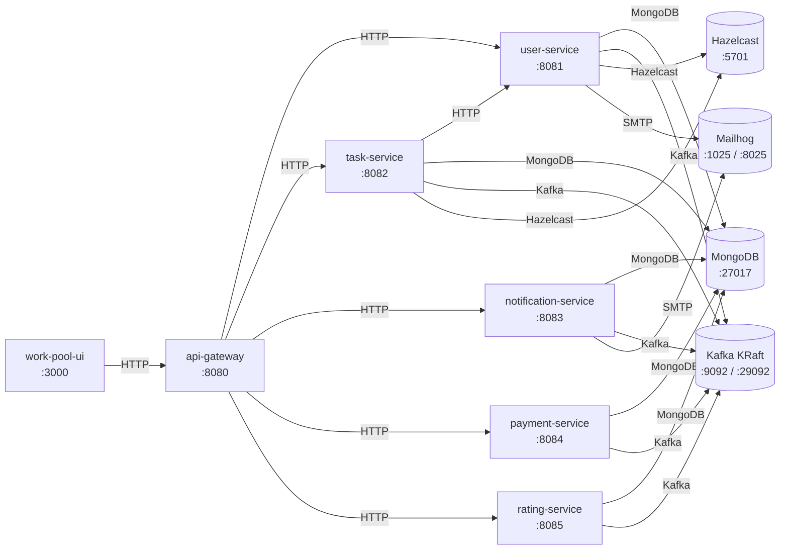

# Work Pool

Task marketplace monorepo (Spring Boot microservices + React UI).

## Monorepo

```text
work-pool/
├── work-pool-backend/
│   ├── work-pool-common
│   ├── work-pool-api-gateway
│   ├── work-pool-user-service
│   ├── work-pool-task-service
│   ├── work-pool-notification-service
│   ├── work-pool-payment-service
│   └── work-pool-rating-service
└── work-pool-ui
```

Each backend module now has its own README under its module directory.

## Architecture diagram



## Service connectivity

- UI (`work-pool-ui`) calls API Gateway over HTTP (`http://localhost:8080`).
- API Gateway routes synchronous REST requests to backend services.
- Task Service calls User Service directly for user/task coordination.
- All backend services use Kafka (KRaft mode) for async event flows.
- User and Task services connect to Hazelcast for distributed state/caching.
- User, Task, Notification, Payment, and Rating services store data in MongoDB (separate databases in one Mongo instance).
- User and Notification services send email through Mailhog SMTP for local/dev flows.

## Local end-to-end run (Docker Compose)

```bash
cd /home/runner/work/work-pool/work-pool
cp .env.example .env
docker compose build
docker compose up -d
```

Endpoints:
- UI: `http://localhost:3000`
- API gateway: `http://localhost:8080`
- User service swagger: `http://localhost:8081/swagger-ui.html`
- Task service swagger: `http://localhost:8082/swagger-ui.html`
- Notification service swagger: `http://localhost:8083/swagger-ui.html`
- Payment service swagger: `http://localhost:8084/swagger-ui.html`
- Rating service swagger: `http://localhost:8085/swagger-ui.html`

## Local run (without Docker for apps)

Start infra first (Mongo/Kafka/Hazelcast/Mailhog):
```bash
cd /home/runner/work/work-pool/work-pool
docker compose up -d mongodb kafka hazelcast hazelcast-management mailhog
```

Run backend:
```bash
cd /home/runner/work/work-pool/work-pool/work-pool-backend
mvn clean verify
mvn -pl work-pool-user-service spring-boot:run
mvn -pl work-pool-task-service spring-boot:run
mvn -pl work-pool-notification-service spring-boot:run
mvn -pl work-pool-payment-service spring-boot:run
mvn -pl work-pool-rating-service spring-boot:run
mvn -pl work-pool-api-gateway spring-boot:run
```

Run UI:
```bash
cd /home/runner/work/work-pool/work-pool/work-pool-ui
npm install
npm run dev
```

## Security and fraud-hardening updates

- Login audit capture added in user service for each password login attempt:
  - external/client IP
  - forwarded IP chain
  - user-agent
  - language/origin/referer
  - request correlation id
  - optional geo headers from reverse proxies
- Account lockout added for repeated failed login attempts.
- Public user profile API now masks sensitive contact/location details.

## Publisher-finisher messaging (pre-Phase 7 enablement)

- New secure task messaging endpoint:
  - `POST /api/v1/tasks/{taskId}/messages`
- Only task publisher and assigned finisher can message each other.
- Messages flow through Kafka notification topic and are delivered in real-time via WebSocket.

## Local OAuth login testing (“Continue with Google/Facebook”)

1. Create OAuth apps in Google/Facebook developer consoles.
2. Set callback URLs to user service callback routes:
   - `http://localhost:8081/api/v1/auth/oauth2/callback/google`
   - `http://localhost:8081/api/v1/auth/oauth2/callback/facebook`
3. Put credentials into `.env`:
   - `GOOGLE_CLIENT_ID`, `GOOGLE_CLIENT_SECRET`
   - `FACEBOOK_CLIENT_ID`, `FACEBOOK_CLIENT_SECRET`
4. Start stack and use login/register page “Google” or “Facebook” buttons.

## Local test payments

1. Use Razorpay test credentials in `.env`:
   - `RAZORPAY_KEY_ID=rzp_test_...`
   - `RAZORPAY_KEY_SECRET=...`
   - `RAZORPAY_WEBHOOK_SECRET=...`
2. Create an order using payment API (`POST /api/v1/payments/orders`).
3. Complete checkout in Razorpay test mode (test card/UPI).
4. Validate webhook handling through `POST /api/v1/payments/webhook`.

## Quality gates and coverage

Backend:
- `mvn clean verify` now runs:
  - unit tests
  - Checkstyle
  - SpotBugs
  - JaCoCo reporting/checks (work-pool-common coverage gate)

Frontend:
- `npm run lint`
- `npm run build`

## CI

GitHub Actions workflow added at `.github/workflows/ci.yml`:
- backend quality/build/test
- frontend lint/build
- docker compose smoke validation
