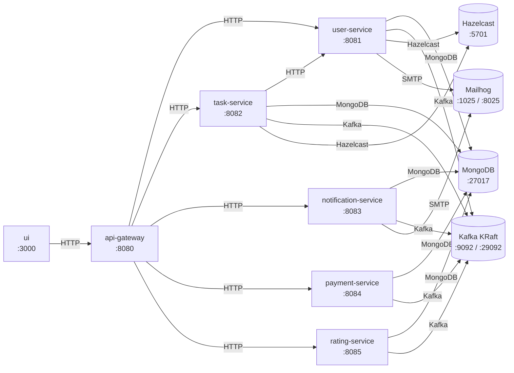
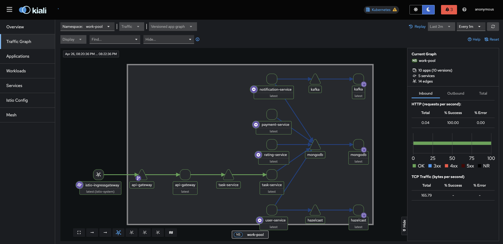
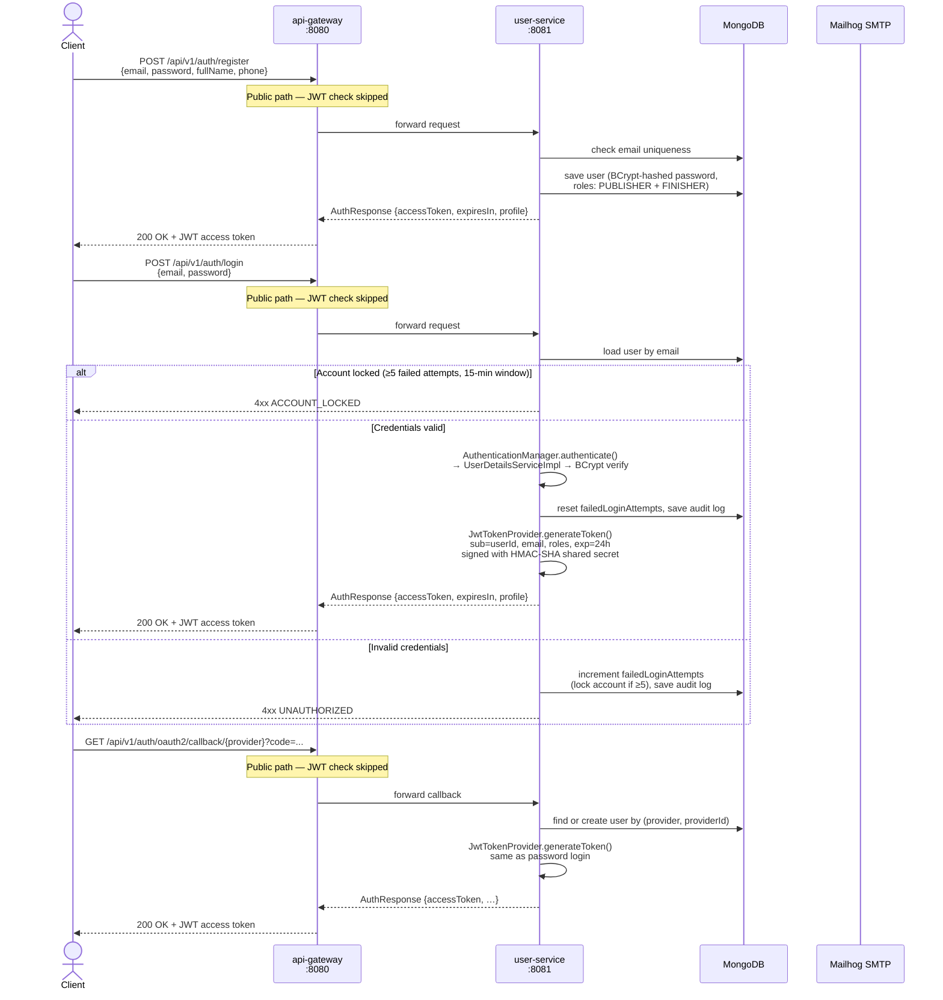
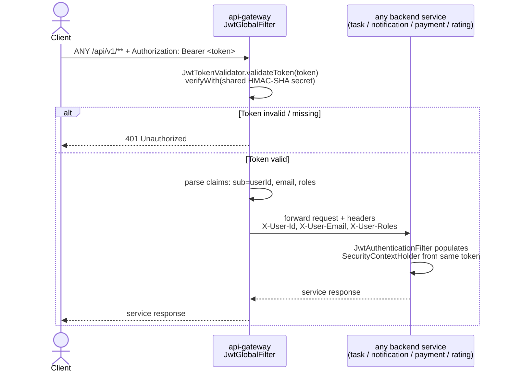

# Work Pool

Task marketplace monorepo (Spring Boot microservices + React UI).

## Prerequisites

- Java 21 (backend build/runtime)
- Node.js 20+ (UI build/runtime)

## Monorepo

```text
work-pool/
├── backend/
│   ├── common
│   ├── api-gateway
│   ├── user-service
│   ├── task-service
│   ├── notification-service
│   ├── payment-service
│   └── rating-service
└── ui
```

Each backend module now has its own README under its module directory.

## Architecture diagram



## Service connectivity diagram

```
┌──────────────────────────────────────────────────────────────────────────────────────────┐
│                                   work-pool namespace                                    │
│                                                                                          │
│  ┌──────────┐   ┌─────────────┐   ┌──────────────────┐                                  │
│  │    UI    │──▶│ api-gateway │──▶│  user-service    │──┐                               │
│  │  :3000   │   │   :8080     │   │     :8081        │  │                               │
│  └──────────┘   │             │   └──────────────────┘  │  ┌──────────────────────┐    │
│                 │             │                          ├─▶│  MongoDB  :27017     │    │
│                 │             │   ┌──────────────────┐  │  └──────────────────────┘    │
│                 │             │──▶│  task-service    │──┘                               │
│                 │             │   │     :8082        │                                  │
│                 │             │   └────────┬─────────┘                                  │
│                 │             │            │ HTTP (user lookup)                         │
│                 │             │            ▼                                             │
│                 │             │   ┌──────────────────┐   ┌──────────────────────┐      │
│                 │             │──▶│notification-svc  │──▶│  Kafka (KRaft)       │      │
│                 │             │   │     :8083        │   │  :9092               │      │
│                 │             │   └──────────────────┘   │                      │      │
│                 │             │                           │                      │      │
│                 │             │   ┌──────────────────┐   │                      │      │
│                 │             │──▶│  payment-service │──▶│                      │      │
│                 │             │   │     :8084        │   └──────────────────────┘      │
│                 │             │   └──────────────────┘                                  │
│                 │             │                           ┌──────────────────────┐      │
│                 │             │   ┌──────────────────┐   │  Hazelcast  :5701    │      │
│                 │             │──▶│  rating-service  │   └──────────┬───────────┘      │
│                 └─────────────┘   │     :8085        │              ▲                  │
│                                   └──────────────────┘              │                  │
│                                                                      │                  │
│  user-service ───────────────────────────────────────────────────▶──┘                  │
│  task-service ───────────────────────────────────────────────────▶──┘                  │
│                                                                                          │
│  user-service / notification-service ──────────────────────────▶  Mailhog  :1025 SMTP  │
└──────────────────────────────────────────────────────────────────────────────────────────┘

  External traffic flow (Kubernetes / Istio):

  ┌─────────┐   ┌──────────────────────────┐   ┌─────────────────┐   ┌──────────────────┐
  │ Browser │──▶│   Istio Ingress Gateway  │──▶│   api-gateway   │──▶│ backend services │
  └─────────┘   │  api.work-pool.org       │   │   (k8s svc)     │   └──────────────────┘
                │  ui.work-pool.org        │──▶├─────────────────┤
                │  kiali.work-pool.org     │   │  work-pool-ui   │
                │  prometheus.work-pool.org│   │  (nginx :80)    │
                └──────────────────────────┘   ├─────────────────┤
                                               │     Kiali       │
                                               ├─────────────────┤
                                               │   Prometheus    │
                                               └─────────────────┘
```

## Kiali service mesh dashboard

Kiali provides a real-time traffic graph, health indicators, and Istio config validation for the `work-pool` namespace.

**Screenshot (live traffic graph — April 2026):**



> The graph shows the `istio-ingressgateway` routing traffic through `api-gateway` to all five backend microservices (`user-service`, `task-service`, `notification-service`, `payment-service`, `rating-service`) and their dependencies (`mongodb`, `kafka`, `hazelcast`). 100 % HTTP success rate with mTLS (PERMISSIVE mode) enforced via `PeerAuthentication`.

**Access Kiali locally (kind cluster):**

```bash
# Port-forward directly
kubectl port-forward svc/kiali -n istio-system 20001:20001

# Or via the Istio ingress host entry (after bootstrap)
open http://kiali.work-pool.org
```

**Key views to check:**

| View | What to look for |
|---|---|
| Traffic Graph → `work-pool` | All services connected, green edges, no red/orange errors |
| Istio Config | No validation warnings on VirtualServices / Gateway |
| Applications | All apps show healthy workloads |
| Services | `api-gateway`, `user-service`, `task-service`, etc. all present |

## Authentication flow

### Token generation — register / login / OAuth2



### JWT validation on every protected request



**Key facts about the JWT:**

| Property | Value |
|---|---|
| Signing algorithm | HMAC-SHA-256 (shared secret `JWT_SECRET`) |
| Claims | `sub`=userId, `email`, `roles` (comma-separated) |
| Default expiry | 24 h (configurable via `jwt.expiration-ms`) |
| Shared secret scope | API Gateway + all backend services use the same `JWT_SECRET` env var |
| Propagation | Gateway forwards decoded identity as `X-User-Id`, `X-User-Email`, `X-User-Roles` headers |
| Session policy | Stateless — no server-side session; each request is verified independently |

## Service connectivity

- UI (`ui`) calls API Gateway over HTTP (`http://localhost:8080`).
- API Gateway routes synchronous REST requests to backend services.
- Task Service calls User Service directly for user/task coordination.
- All backend services use Kafka (KRaft mode) for async event flows.
- User and Task services connect to Hazelcast for distributed state/caching.
- User, Task, Notification, Payment, and Rating services store data in MongoDB (separate databases in one Mongo instance).
- User and Notification services send email through Mailhog SMTP for local/dev flows.

## Local end-to-end run (Docker Compose)

```bash
cd /home/runner/work/work-pool/work-pool
cp .env.example .env
docker compose build
docker compose up -d
```

Endpoints:
- UI: `http://localhost:3000`
- API gateway: `http://localhost:8080`
- User service swagger: `http://localhost:8081/swagger-ui.html`
- Task service swagger: `http://localhost:8082/swagger-ui.html`
- Notification service swagger: `http://localhost:8083/swagger-ui.html`
- Payment service swagger: `http://localhost:8084/swagger-ui.html`
- Rating service swagger: `http://localhost:8085/swagger-ui.html`

## Local run (without Docker for apps)

Start infra first (Mongo/Kafka/Hazelcast/Mailhog):
```bash
cd /home/runner/work/work-pool/work-pool
docker compose up -d mongodb kafka hazelcast hazelcast-management mailhog
```

Run backend:
```bash
cd /home/runner/work/work-pool/work-pool/backend
mvn clean verify
mvn -pl user-service spring-boot:run
mvn -pl task-service spring-boot:run
mvn -pl notification-service spring-boot:run
mvn -pl payment-service spring-boot:run
mvn -pl rating-service spring-boot:run
mvn -pl api-gateway spring-boot:run
```

Run UI:
```bash
cd /home/runner/work/work-pool/work-pool/work-pool-ui
npm install
npm run dev
```

## Security and fraud-hardening updates

- Login audit capture added in user service for each password login attempt:
  - external/client IP
  - forwarded IP chain
  - user-agent
  - language/origin/referer
  - request correlation id
  - optional geo headers from reverse proxies
- Account lockout added for repeated failed login attempts.
- Public user profile API now masks sensitive contact/location details.

## Publisher-finisher messaging (pre-Phase 7 enablement)

- New secure task messaging endpoint:
  - `POST /api/v1/tasks/{taskId}/messages`
- Only task publisher and assigned finisher can message each other.
- Messages flow through Kafka notification topic and are delivered in real-time via WebSocket.

## Local OAuth login testing (“Continue with Google/Facebook”)

1. Create OAuth apps in Google/Facebook developer consoles.
2. Set callback URLs to user service callback routes:
   - `http://localhost:8081/api/v1/auth/oauth2/callback/google`
   - `http://localhost:8081/api/v1/auth/oauth2/callback/facebook`
3. Put credentials into `.env`:
   - `GOOGLE_CLIENT_ID`, `GOOGLE_CLIENT_SECRET`
   - `FACEBOOK_CLIENT_ID`, `FACEBOOK_CLIENT_SECRET`
4. Start stack and use login/register page “Google” or “Facebook” buttons.

## Local test payments

1. Use Razorpay test credentials in `.env`:
   - `RAZORPAY_KEY_ID=rzp_test_...`
   - `RAZORPAY_KEY_SECRET=...`
   - `RAZORPAY_WEBHOOK_SECRET=...`
2. Create an order using payment API (`POST /api/v1/payments/orders`).
3. Complete checkout in Razorpay test mode (test card/UPI).
4. Validate webhook handling through `POST /api/v1/payments/webhook`.

## Quality gates and coverage

Backend:
- `mvn clean verify` now runs:
  - unit tests
  - Checkstyle
  - SpotBugs
  - JaCoCo reporting/checks (common coverage gate)

Frontend:
- `npm run lint`
- `npm run build`

## CI

GitHub Actions workflow added at `.github/workflows/ci.yml`:
- backend quality/build/test
- frontend lint/build
- docker compose smoke validation
